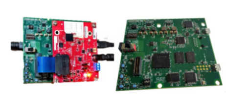
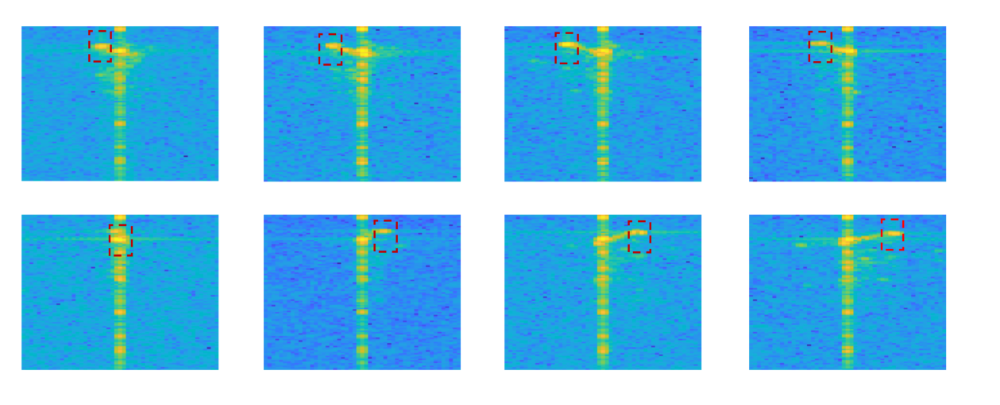
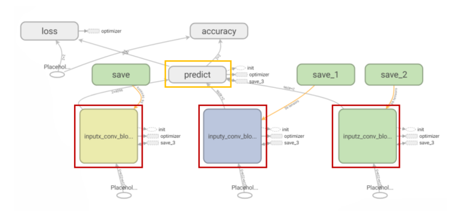
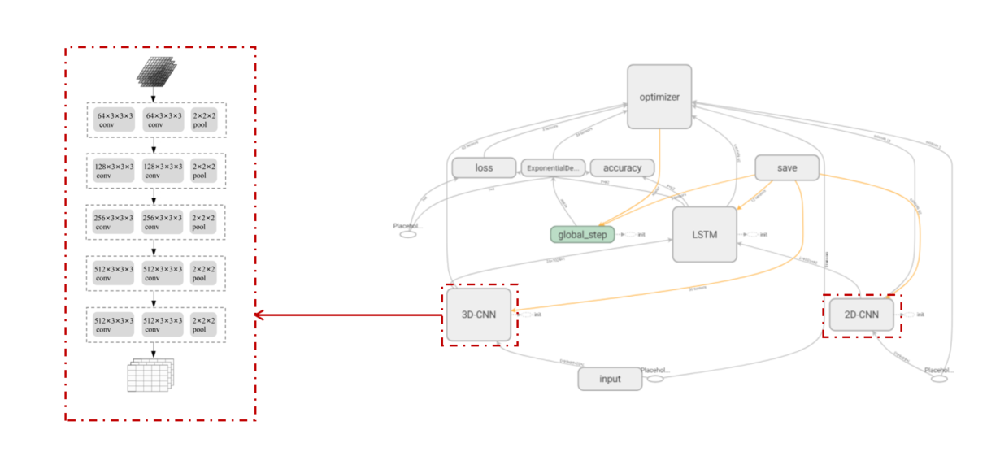
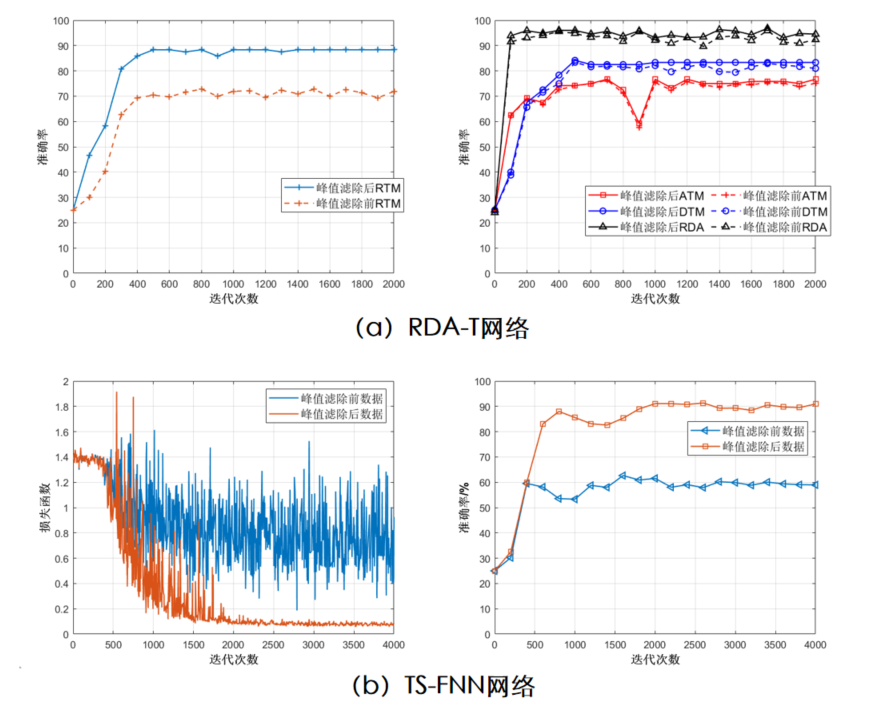

  

**News**: We released the report on [ICSIP](https://ieeexplore.ieee.org/document/9339325).

## Dynamic Gesture Recognition Based on FMCW

pass.

This works based on **Tensorflow 1.12**.

### Major images

- **Range-Doppler Map**

  
  
  
  
- **Multi-Net structure**

  
  
- **TS-FNN structure**

  

- **Result**

  

## Code explaination

- [x] GeneratexTM: Generate Angle-Time/Range-Time/Doppler-Time Map.
- [x] GenerateRDM: Generate Range-Doppler Map.
- [x] Multi-Net: Nerual network code with ATM/RTM/DTM as the input, just using 2d-cnn.
- [x] TS-FNN: Nerual network code with ATM/RDM as the input, using 3d-cnn and LSTM.
- [x] tools: some python scripts

## License

This project is released under the [Apache 2.0 license](LICENSE).
