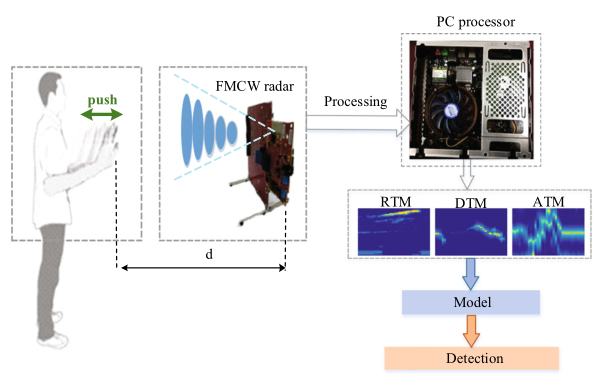

**News**: 
- We released the report on [ICSIP](https://ieeexplore.ieee.org/document/9339325).
- We released the report on [IET IRC](https://digital-library.theiet.org/content/conferences/10.1049/icp.2021.0704)
## Dynamic Gesture Recognition Based on FMCW

This project is based on FMCW radar, and completed the data acquisition of four kinds of dynamic gesture signals. Then we use Matlab to generate RDM/xTM images, which is as the input of Multi-Net and TS-FNN. The acc is about 98%.

This works based on **Tensorflow 1.12**.

### Major images

- **Range-Doppler Map**

  

  

  

  
- **Multi-Net structure**

  

  
- **TS-FNN structure**

  

- **Result**

  

## Code explaination

- [x] GeneratexTM: Generate Angle-Time/Range-Time/Doppler-Time Map.
- [x] GenerateRDM: Generate Range-Doppler Map.
- [x] Multi-Net: Nerual network code with ATM/RTM/DTM as the input, just using 2d-cnn.
- [x] TS-FNN: Nerual network code with ATM/RDM as the input, using 3d-cnn and LSTM.
- [x] tools: some python scripts
- [x] simulations: refer to [handwave simulation](https://github.com/liynjy/FMCW-Radar-Simulator)
## License

This project is released under the [Apache 2.0 license](LICENSE).
